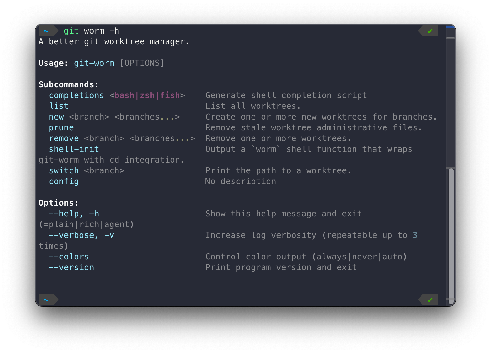

# git-worm


> Git WORktree Manager

[](https://github.com/ThatXliner/git-worm/actions/workflows/ci.yml) [](https://pypi.org/project/git-worm)
[](https://pypi.org/project/git-worm)
[](#license)


https://github.com/user-attachments/assets/916af237-e959-43fc-9046-067929ad874f

A better git worktree manager. Built with [Xclif](https://github.com/ThatXliner/xclif).

## Why?

`git worktree` is powerful but raw. git-worm adds:

- **Automatic file management** — gitignored files (`.env`, `.venv`, `node_modules`, etc.) are copied into new worktrees so switching feels like `git switch`
- **Smart package manager detection** — pnpm/bun/Yarn PnP users don't get unnecessary `node_modules` copies
- **Nice UI** — Rich-formatted output, tree views, colored status. You can also create multiple worktrees in one command!

## Install

Requires Python 3.12+

```bash
pip install git-worm
```

Or with [uv](https://github.com/astral-sh/uv):

```bash
uv tool install git-worm
```

## Usage

Because of [Xclif](https://github.com/ThatXliner/xclif), git-worm automatically gets a very nice-looking help page



```bash
# Create a new worktree (copies .env, .venv, etc. automatically)
git worm new feat-login

# Create from a specific ref
git worm new feat-login --from-ref main

# List all worktrees
git worm list

# Print worktree path
git worm switch feat-login

# Remove a worktree
git worm rm feat-login

# Remove even if dirty
git worm rm feat-login --force

# Shell integration (add to .bashrc/.zshrc)
eval "$(git-worm shell-init)"
# Then: worm switch feat-login  (auto-cds)
```

### Shell integration

`git-worm shell-init` outputs a `worm` shell function that wraps `git-worm`. This is needed because `worm switch` needs to `cd` into the worktree directory, which a plain subprocess can't do. All other commands are forwarded to `git-worm` as-is.

Add this to your `.bashrc` or `.zshrc`:

```bash
eval "$(git-worm shell-init)"
```

Then use `worm` instead of `git-worm`:

```bash
worm new feat-login
worm switch feat-login  # cds into the worktree
worm list
```

## Configuration

Optional `.git-worm.toml` in your repo root:

```toml
[settings]
worktree_dir = ".worktrees"  # default
post_create = ["bun install"]

[[share]]
path = ".env*"
strategy = "copy"

[[share]]
path = "node_modules"
strategy = "ignore"

[[share]]
path = "target"
strategy = "symlink"
```

Strategies: `copy`, `reflink` (COW, falls back to copy), `symlink`, `ignore`.

When a config file is present, share rules replace the default behavior entirely.

### Post-create hooks

The `post_create` array runs shell commands in the new worktree after it's created. This is useful for setting up dependencies when `node_modules` is skipped:

```toml
[settings]
post_create = ["pnpm install", "cargo fetch"]
```

If no `post_create` hook is configured and `node_modules` was skipped, git-worm prints a hint with the detected install command.

## Default Behavior (no config)

1. All gitignored files/dirs are detected
2. `.git/` and `.worktrees/` are excluded
3. Files are plain-copied, directories are reflinked (with copy fallback)
4. `node_modules/` is skipped if pnpm, bun, or Yarn PnP is detected

## License

Public Domain
